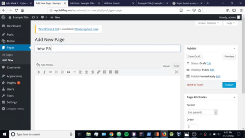

# CodePath week 7 - Wordpress Pentesting.

Time spent: **6.5** hours.

Objective: Find, analyze, recreate, and document at least 3 vulnerabilities affecting an old version of WordPress

## Pentesting Report

1. (Required) Vulnerability: Authenticated Stored Cross-site scripting

  - [x] Summary:
    - Vulnerability types: XSS
    - Tested in version: 4.2
    - Fixed in version: Later Version
  - [x] GIF Walkthrough:  
  - [x] Steps to recreate:
    - Make a new Post and place the text ``` ```. You should see something on and alert appear.
  - [x] Link to affected code: 
        [Link](https://core.trac.wordpress.org/browser/branches/4.2/src/wp-admin/includes/image.php)
        


2. (Required) Vulnerability: Authenticated Stored Cross-Site Scripting via Image Filename

  - [x] Summary:
    - Vulnerability types: XSS
    - Tested in version: 4.2
    - Fixed in version: Later Version
  - [x] GIF Walkthrough:   
  - [x] Steps to recreate:
      Go to media and upload a new image from your local drive. After that update the images name with the text --->
        ```
           ImageName.png
        ```
3. (Required) Vulnerability Name or ID: User Enumeration

  - [x] Summary: this vulnerablility will remote attackers to create a crafted image file name that will inject arbitrary web script.
    - Vulnerability types: User Enumeration
    - Tested in version: 4.2
    - Fixed in version: Later Version
  - [x] GIF Walkthrough: 
  
  - [x] Steps to recreate: Attempt to log into admin without the use of the password. after that do the same with an incorrect password
  , finally attempt to log in with user.
  - [x] Link to affected code: 
     [Link](https://core.trac.wordpress.org/browser/tags/version/src/source_file.php)
  

       

  4. 3. (Optional)Authenticated Stored Cross-Site Scripting (XSS) in YouTube URL Embeds
  
  - [x] Summary: This vulnerablity allows remote attackers to inject arbitrary web script or HTML via video URL in YouTube emebeds.
    - Vulnerability types: XSS
    - Tested in version: 4.2
    - Fixed in version: Later Version
  - [x] GIF Walkthrough:

     

  - [x] Steps to recreate: Make a new page and paste the code below:

    ```
    [embed src='https://youtube.com/embed/5678\x3csvg onload=alert(1)\x3e'][/embed]
    ```

    When you view the page the injection executes.


## Assets

List any additional assets, such as scripts or files

## Resources

- [WordPress Source Browser](https://core.trac.wordpress.org/browser/)
- [WordPress Developer Reference](https://developer.wordpress.org/reference/)


## License

    Copyright [2018] [Evan Vasquez]

    Licensed under the Apache License, Version 2.0 (the "License");
    you may not use this file except in compliance with the License.
    You may obtain a copy of the License at

        http://www.apache.org/licenses/LICENSE-2.0

    Unless required by applicable law or agreed to in writing, software
    distributed under the License is distributed on an "AS IS" BASIS,
    WITHOUT WARRANTIES OR CONDITIONS OF ANY KIND, either express or implied.
    See the License for the specific language governing permissions and
    limitations under the License.
